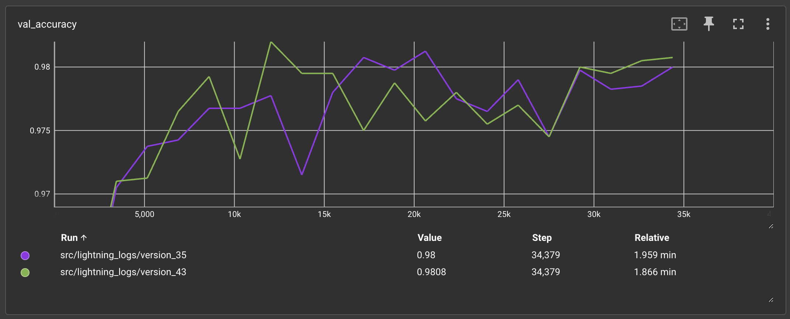
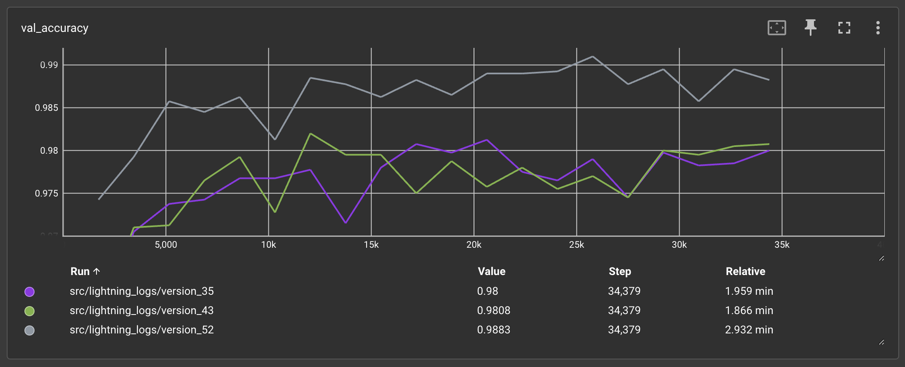

# lightning-ai-demonstration

A quick and simple introduction to creating, training, and running a simple neural network to do image classification. It is presented [in Jupyter notebook form](https://github.com/merrillmckee/lightning-ai-demonstration/blob/main/src/lightning-ai-demo-gpu.ipynb) and can be shared in less than 60 minutes.

It leverages `Lightning` and `PyTorch`.

From `Lightning`, we inherit `LightningModule` which forms the basis for our neural network model. And we also use its `Trainer` to train our network. `Lightning` tries to build on top of `PyTorch` to simplify the process of building a neural network. Besides less code, this example could be run on a GPU (for example, I've done this with a Macbook Pro M2) with no code changes. The term GPU never appears in this notebook code; it has been abstracted away.

From `PyTorch`, we use the built-in MNIST dataset, we use its utilties to architect the fully connected neural network with 1 hidden layer, and we use its Adam optimizer. From its related library, `torchmetrics`, we track the network's training and validation accuracy.

Finally, outside of the notebook, we can optionally run `TensorBoard` to visualize the training progress with metrics. Here is an example window pane from Tensorboard showing the validation accuracy of two runs. This simple network can achieve validation accuracy over 98%.

Update: It did not take much to change the `HelloModel` [link](https://github.com/merrillmckee/lightning-ai-demonstration/blob/main/src/lightning-ai-demo-gpu.ipynb) from a single-layer fully connected neural network to a CNN based on the `LeNet` architecture `LeNetModel` [link](https://github.com/merrillmckee/lightning-ai-demonstration/blob/main/src/lightning-ai-lenet.ipynb). The change in architecture brings accuracy closer to 99% from the previous 98%. State of the art MNIST results typically achieve 99.7% to 99.9% so still room for improvement!

